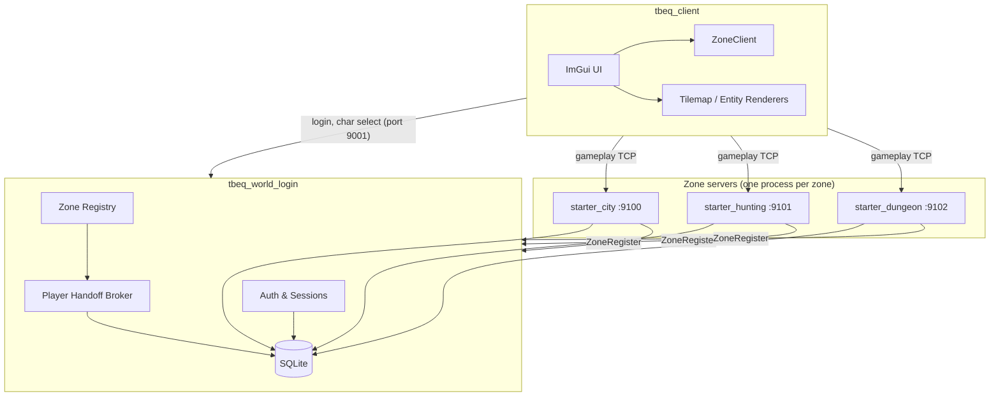
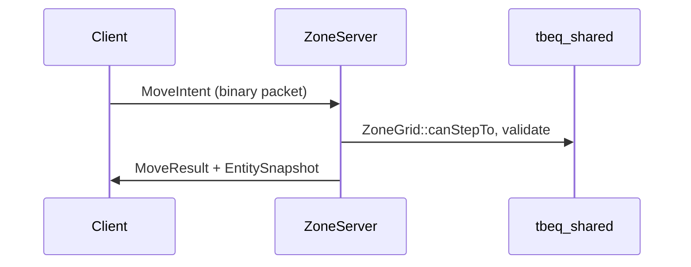
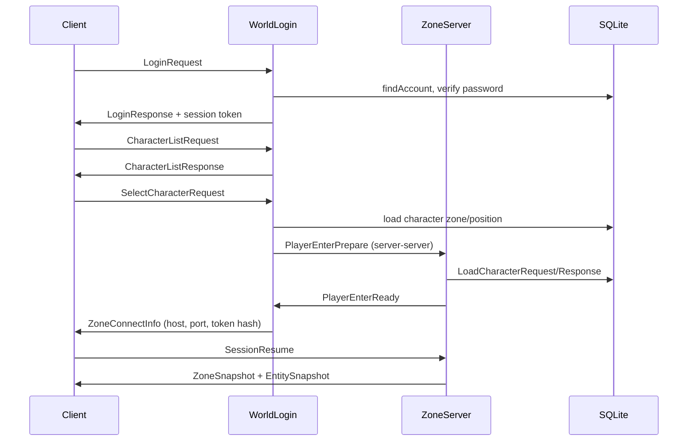
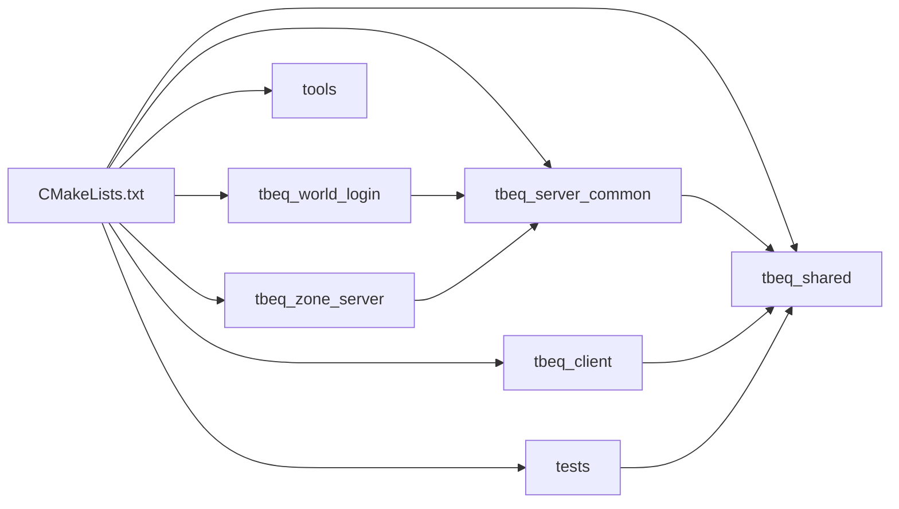

# Architecture Overview

This document describes the high-level system architecture of TurnBasedEQ: process topology, authority model, and major data flows. For C++ engineering patterns, see [cpp-architecture.md](cpp-architecture.md). For build and run instructions, see [build-and-run.md](build-and-run.md).

---

## System purpose

TurnBasedEQ is a **Phase 0–5.5 MMO foundation** implemented in C++20. It provides:

- Account login and character management
- Multi-zone server cluster with portal travel
- Authoritative zone simulation (movement, combat, inventory, merchants)
- A graphical SDL2 + ImGui client
- SQLite-backed character persistence
- JSON-driven game content

The server is **authoritative**; the client sends intents and renders snapshots received from zone servers.

---

## Process topology

### Process roles

| Process | Executable | Default ports | Role |
|---------|------------|---------------|------|
| WorldLogin | `tbeq_world_login.exe` | Zone link: 9000, Client: 9001 | Auth, sessions, zone registry, character CRUD, zone transfer broker |
| Zone server | `tbeq_zone_server.exe` | Client: 9100+ (per zone) | Gameplay simulation for one zone; registers with WorldLogin |
| Client | `tbeq_client.exe` | — | Rendering, UI, sends player intents |
| Tools | `tbeq_data_validator`, `tbeq_worldgen` | — | Offline content validation and world generation |

All server processes share one SQLite database file (`config/tbeq.db` by default).

---

## Shared library contract

The `tbeq_shared` static library is the **single source of truth** for:

- Binary packet structs and serialization
- Combat resolution (`CombatInstance`)
- Skills, items, content catalogs
- Character state JSON serialization
- Database access layer

Client, both server executables, and all tests link against `tbeq_shared`. This prevents client/server type drift.

See [shared.md](shared.md) for module details.

---

## Login and zone entry flow

After `ZoneConnectInfo`, the client opens a **direct TCP connection** to the zone server's client port for all gameplay packets.

Details: [networking.md](networking.md), [auth.md](auth.md).

---

## Zone transfer (portal travel)

When a player uses a portal (`P` on a portal tile):

1. Source zone validates portal tile and sends `ZoneTransferRequest` to WorldLogin.
2. WorldLogin records a pending transfer and sends `PlayerEnterPrepare` to the destination zone.
3. Destination zone loads character state from SQLite.
4. WorldLogin sends `ZoneTransferAuthorize` to the destination zone with session info.
5. Client receives `UsePortalResult` with new `ZoneConnectInfo`.
6. Client disconnects from source zone and `SessionResume`s on destination zone.
7. Source zone evicts the player; destination zone restores full character state.

Character `state_json` (inventory, equipment, vitals, skills) is persisted before transfer and on disconnect.

---

## Concurrency model

Each server process runs a **single-threaded** `asio::io_context` event loop. Shared state (`players_`, `npcs_`, `combats_`) is protected by `std::mutex` in `ZoneServer` and WorldLogin.

The client uses the SDL main thread for rendering and may offload login to `std::async` to avoid blocking the UI.

See [cpp-architecture.md](cpp-architecture.md#concurrency-model) for rationale.

---

## Content and world data

| Layer | Source | Loaded by |
|-------|--------|-----------|
| Static catalogs | `data/*.json` | Client + zone servers at startup |
| Procedural world | `data/worldgen/` + seed | WorldLogin on first DB bootstrap |
| Runtime state | `characters.state_json` | Zone servers on player enter/resume |
| Zone geometry | `zone_tiles`, `zone_portals` tables | ZoneGrid per zone server |

See [content-and-data.md](content-and-data.md).

---

## Dev cluster layout

`scripts/run_cluster.ps1` starts four processes:

| Zone ID | Client port | Notable portals |
|---------|-------------|-----------------|
| `starter_city` | 9100 | North (32,8) → Hunting Grounds |
| `starter_hunting` | 9101 | South (64,8) → City; East (120,64) → Goblin Cave |
| `starter_dungeon` | 9102 | West (4,24) → Hunting Grounds |

WorldLogin listens on 9000 (zone registration) and 9001 (client login).

---

## CMake target graph

---

## Key entry points

| Component | Entry file |
|-----------|------------|
| WorldLogin | `server/world_login/main.cpp` |
| Zone server | `server/zone/main.cpp` |
| Client | `client/src/main.cpp` |
| Shared config parsing | `shared/src/core/Config.cpp` |
| World bootstrap | `shared/src/worldgen/WorldBootstrap.cpp` |

---

## Related documentation

- [server.md](server.md) — server internals
- [client.md](client.md) — client architecture
- [combat-system.md](combat-system.md) — turn-based combat
- [data-models.md](data-models.md) — persistence schema
- [module-reference.md](module-reference.md) — file-level reference
