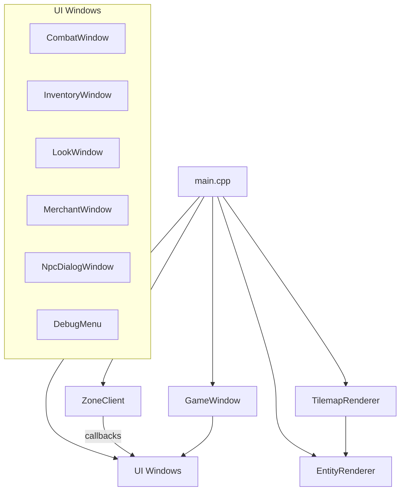

# Client Components

The TurnBasedEQ client is an SDL2 + ImGui application that handles login UI, zone rendering, gameplay windows, and TCP communication with zone servers.

**Entry point:** `client/src/main.cpp`

See also: [networking.md](networking.md), [build-and-run.md](build-and-run.md).

---

## Build target

`client/CMakeLists.txt` defines `tbeq_client`:

| Dependency | Purpose |
|------------|---------|
| `tbeq_shared` | Packets, catalogs, domain types |
| SDL2 | Window, input, SDL_Renderer |
| imgui (vcpkg) | UI widgets and layout |
| imgui SDL2/SDLRenderer backends | Integration glue |

Compile definitions:

- `TBEQ_REPO_ROOT` — repo path for debug tools
- `TBEQ_ENABLE_DEBUG_MENU` — 0 or 1 based on CMake option

---

## Architecture

---

## Application states

`ClientState` enum in `main.cpp`:

| State | Behavior |
|-------|----------|
| `Login` | Account login, character select/create UI |
| `InZone` | Connected to zone server; world rendering and gameplay UI |

Login may run on a background thread via `std::async` to keep ImGui responsive.

---

## Networking

### ZoneClient

**Files:** `client/net/ZoneClient.hpp`, `ZoneClient.cpp`

Synchronous-style API over ASIO TCP socket:

| Method | Purpose |
|--------|---------|
| `connect(host, port)` | Open TCP to zone server |
| `sessionResume(...)` | Enter zone, receive snapshot |
| `moveTo(x, y)` | Send move intent, wait for result |
| `usePortal()` | Request zone transfer |
| `submitAction(...)` | Combat action |
| `equipItem` / `unequipItem` | Equipment changes |
| `interactNpc` / `merchantBuy` / `merchantSell` | NPC commerce |
| `pollGameplayPackets()` | Process async server pushes |

Callback setters for server-initiated packets (combat events, chat, vitals, inventory updates).

### LocalClusterLauncher

**Files:** `client/net/LocalClusterLauncher.hpp`, `LocalClusterLauncher.cpp`

Optional helper to spawn WorldLogin and zone processes from the client for integrated dev workflows.

### LoginProfiler

**Files:** `client/net/LoginProfiler.hpp`, `LoginProfiler.cpp`

Timing instrumentation for login pipeline stages.

---

## Rendering

### TilemapRenderer

**Files:** `client/render/TilemapRenderer.hpp`, `TilemapRenderer.cpp`

Renders zone tile grid using procedurally generated tile textures from `TileGenerator`. Camera follows player tile position.

### EntityRenderer

**Files:** `client/render/EntityRenderer.hpp`, `EntityRenderer.cpp`

Draws players, NPCs, and other entities as procedural sprites. Supports nameplates with role coloring (merchant gold, lorekeeper blue).

### Procedural generators

| Class | File | Output |
|-------|------|--------|
| `TileGenerator` | `render/procedural/TileGenerator.cpp` | Tile textures from style + tile def |
| `SpriteGenerator` | `render/procedural/SpriteGenerator.cpp` | Entity sprites from `entity_sprites.json` |
| `ItemIconGenerator` | `render/procedural/ItemIconGenerator.cpp` | Inventory item icons |

### Supporting render utilities

- `TextureCache` — SDL texture lifetime management
- `SpriteRenderer` — blit helpers
- `AnimationTypes.hpp` — animation state definitions

Tile size constant: `TileGenerator::kTileSize` (used for camera and nameplate positioning).

---

## UI system

### GameWindow

**Files:** `client/ui/GameWindow.hpp`, `GameWindow.cpp`

Shell for HUD and chat windows. Draggable, resizable ImGui panels.

### WindowLayoutManager

**Files:** `client/ui/WindowLayoutManager.hpp`, `WindowLayoutManager.cpp`

Persists window positions and sizes to `config/ui_layout.json` on exit.

### Feature windows

| Window | Key | File |
|--------|-----|------|
| CombatWindow | (auto on combat) | `ui/combat/CombatWindow.cpp` |
| InventoryWindow | I | `ui/inventory/InventoryWindow.cpp` |
| LookWindow | L | `ui/look/LookWindow.cpp` |
| MerchantWindow | N (merchant NPC) | `ui/merchant/MerchantWindow.cpp` |
| NpcDialogWindow | N (lorekeeper) | `ui/dialog/NpcDialogWindow.cpp` |

### Debug menu (Debug builds)

**Files:** `ui/debug/DebugMenu.cpp`, `LogViewer.cpp`, `UnitTestRunner.cpp`

- Toggle with **F1**
- Live spdlog log viewer
- Cheats tab: spawn AI cleric, fill mana, unlock spells
- Optional in-client unit test runner

Hidden by default; bottom-right hint shows `F1: Debug Menu`.

---

## Input and gameplay loop

Typical `InZone` frame:

1. Poll SDL events (keyboard, window)
2. `zoneClient.pollGameplayPackets()` — dispatch callbacks
3. Process movement keys → `moveTo()`
4. Handle action keys (I, L, N, P)
5. Update renderers with latest entity snapshot
6. ImGui frame: HUD, chat, open windows
7. SDL render present

Portal hints are appended to system chat on zone entry (hardcoded zone id checks in `appendPortalHints()`).

---

## Content loaded at startup

Client loads JSON catalogs from `data/` for rendering and UI:

- `TileDefCatalog`, `MobCatalog`, `ItemCatalog`
- `entity_sprites.json` for procedural appearance
- Equipment tints applied to player sprites based on equipped gear

---

## Client vs server authority

| Concern | Authority |
|---------|-----------|
| Movement validation | Zone server |
| Combat resolution | Zone server (`CombatInstance`) |
| Inventory/equipment | Zone server |
| Merchant prices/stock | Zone server |
| Rendering, layout, chat display | Client |
| Action selection UI | Client sends `SubmitAction` |

---

## Related documentation

- [networking.md](networking.md) — packet protocol
- [combat-system.md](combat-system.md) — combat UI and actions
- [content-and-data.md](content-and-data.md) — JSON content files
- [shared.md](shared.md) — shared types used by client
