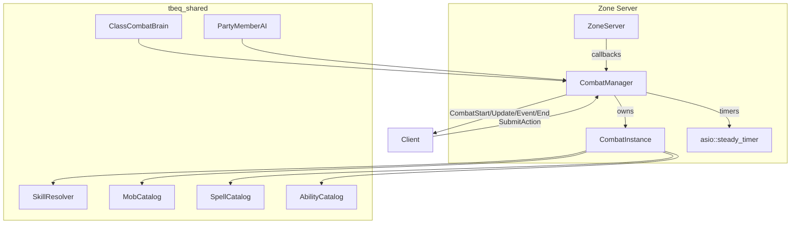
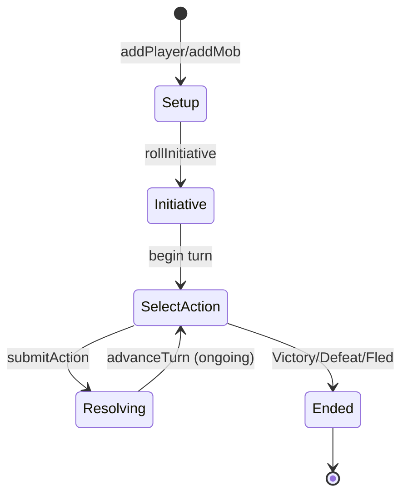
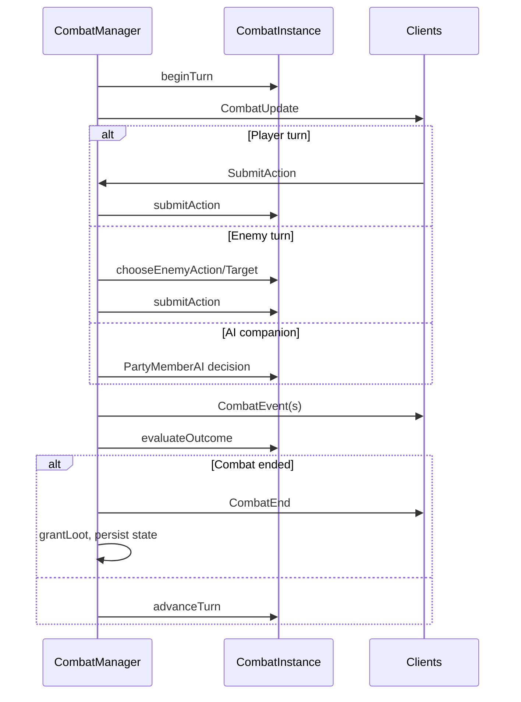

# Combat System

TurnBasedEQ implements **turn-based group combat** with initiative order, melee/spells/abilities, status effects, flee, AI companions, and loot. Combat resolution runs in the shared `CombatInstance` class; the server `CombatManager` orchestrates timers, broadcasts, and persistence.

See also: [shared.md](shared.md), [server.md](server.md), [client.md](client.md).

---

## Architecture



**Authority:** Server only. Client displays combat state and sends action intents.

---

## Core types

Defined in `shared/include/tbeq/combat/CombatTypes.hpp`:

### Enums

| Enum | Values |
|------|--------|
| `CombatSide` | Player, Enemy |
| `CombatPhase` | SelectAction, Resolving, Ended |
| `CombatActionType` | None, MeleeAttack, Defend, Flee, CastSpell, UseAbility |
| `CombatOutcome` | InProgress, Victory, Defeat, Fled |
| `CombatEventType` | Damage, Miss, Heal, SpellCast, StatusApplied, Death, Loot, etc. |
| `StatusEffectType` | Stun, Snare, Dot |

### CombatParticipant

Represents one combatant (player, AI companion, or mob):

- Identity: `characterId` or `mobId`, name, class, race, level
- Vitals: hp, maxHp, mana, maxMana
- Skills: weapon skill, offense/defense/channeling levels, spell/ability lists
- State: alive, defending, god mode, status effects
- Flags: `isPlayerControlled`, `isAiCompanion`

### CombatActionIntent

```cpp
struct CombatActionIntent
{
    CombatActionType action;
    uint32_t targetSlot;
    std::string spellId;
    std::string abilityId;
};
```

---

## CombatInstance

**Files:** `shared/include/tbeq/combat/CombatInstance.hpp`, `shared/src/combat/CombatInstance.cpp`

### Lifecycle



### Key methods

| Method | Purpose |
|--------|---------|
| `addPlayer(...)` | Add player or AI companion with live `CharacterState` ref |
| `addMob(mobDef)` | Spawn enemy from catalog |
| `rollInitiative()` | Build turn order from AGI + random roll |
| `submitAction(intent)` | Resolve action, emit events, advance turn |
| `takePendingEvents()` | Drain event queue for broadcast |
| `rollLoot()` | Generate loot rolls on victory |
| `evaluateOutcome()` | Check win/lose/flee conditions |

### Turn timing

Default `turnDurationMs_ = 30000` (30 seconds). Server `CombatManager` sets `asio::steady_timer` and auto-submits default action on timeout.

### RNG

Constructor takes `std::mt19937&` for reproducible unit tests.

---

## Action resolution

| Action | Resolution |
|--------|------------|
| MeleeAttack | `SkillResolver::rollMeleeHit`, `calculateMeleeDamage` |
| Defend | Sets defending flag, damage reduction next hit |
| Flee | `SkillResolver::rollFlee` based on defense, AGI, enemy count |
| CastSpell | Mana cost, channeling check, resist roll, damage/heal |
| UseAbility | Class abilities (Bash, Kick, Backstab, etc.) via `AbilityCatalog` |

Status effects (stun, snare, DoT) tick on turn start via `tickStatusEffects()`.

---

## SkillResolver integration

**File:** `shared/include/tbeq/skills/SkillResolver.hpp`

| Formula | Used for |
|---------|----------|
| `rollMeleeHit` | Physical hit chance |
| `calculateMeleeDamage` | Melee damage range |
| `rollFlee` | Escape chance |
| `rollChanneling` | Spell fizzle check |
| `rollSpellResist` | Partial/full resist |
| `calculateSpellDamage` / `calculateHealAmount` | Spell outcomes |
| `calculateAbilityDamage` | Ability outcomes |
| `combatSkillXpGain` | XP on hit/miss |
| `meditateManaGain` | Out-of-combat regen |

Skill caps depend on class and character level via `getCap()`.

---

## Server CombatManager

**Files:** `server/zone/combat/CombatManager.hpp`, `CombatManager.cpp`

### Starting combat

| Entry | Trigger |
|-------|---------|
| `tryStartSpawnCombat` | Player walks into active mob spawn aggro range |
| `startDebugCombat` | Debug command with explicit mob ids |

Adds player, AI companions (`findAiCompanionsForLeader`), and mobs from mob table.

### Turn flow



### Post-combat

- Apply skill XP via `applySkillXp()`
- Roll and grant loot via `grantLoot()`
- Persist character state and sync inventory snapshot
- Clear `inCombat` flags on participants

---

## AI systems

| Component | File | Role |
|-----------|------|------|
| `ClassCombatProfileCatalog` | `ai/ClassCombatProfileCatalog.cpp` | JSON priorities per class |
| `ClassCombatBrain` | `ai/ClassCombatBrain.cpp` | Enemy mob tactical choices |
| `PartyMemberAI` | `ai/PartyMemberAI.cpp` | AI cleric/wizard/etc. companion turns |

Profiles: `data/ai/class_combat_profiles.json`.

---

## Client combat UI

**File:** `client/ui/combat/CombatWindow.cpp`

- Displays participant HP/mana bars and turn indicator
- Class ability bar: Warrior Bash/Kick, Cleric heal, Wizard nuke, Rogue backstab
- Sends `SubmitAction` via `ZoneClient`
- Receives async `CombatEvent` for combat log display

Debug cheats (F1 → Cheats): spawn AI cleric, fill mana, unlock all spells.

---

## Wire protocol

| Packet | When sent |
|--------|-----------|
| `CombatStart` | Combat begins — full participant list + turn order |
| `CombatUpdate` | Turn/phase changes |
| `CombatEvent` | Each resolved event (damage, heal, etc.) |
| `SubmitAction` | Client player input |
| `SubmitActionResult` | Immediate accept/reject |
| `CombatEnd` | Final outcome |
| `CharacterVitals` | HP/mana updates outside combat UI |
| `SkillGain` | Skill level-up notification |

Payload structs: `shared/include/tbeq/net/ClientPackets.hpp` (`CombatParticipantPayload`, etc.).

---

## Mob content

Mobs defined in `data/mobs.json`:

```cpp
struct MobDef
{
    std::string id, name;
    uint16_t level, hp, offense, defense, agi;
    std::vector<LootEntry> loot;
};
```

Mob tables map spawn points to random mob selections via `MobCatalog::resolveMobTable()`.

---

## Testing

| Test file | Coverage |
|-----------|----------|
| `combat_initiative_test.cpp` | Turn order |
| `combat_hit_miss_test.cpp` | Hit/miss rolls (seeded RNG) |
| `combat_flee_test.cpp` | Flee mechanics |
| `spell_combat_test.cpp` | Spell casting |
| `class_combat_brain_test.cpp` | AI decisions |
| `combat_encounter_test.cpp` | Full integration via debug spawn |
| `ai_party_combat_test.cpp` | AI companion in combat |

---

## Related documentation

- [content-and-data.md](content-and-data.md) — spells, abilities, mobs JSON
- [networking.md](networking.md) — combat packets
- [data-models.md](data-models.md) — CharacterState in combat
