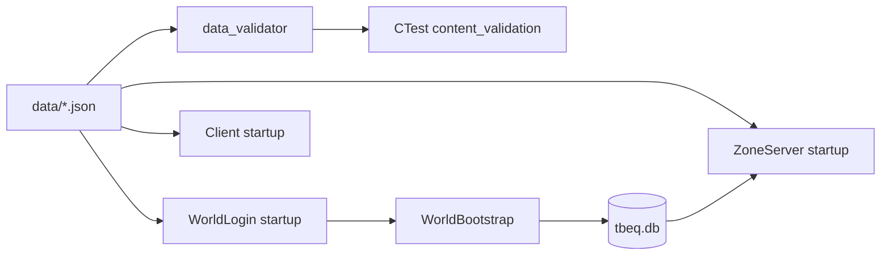

# Content and Data Files

TurnBasedEQ drives gameplay from JSON seed content and procedurally generated world data stored in SQLite. This document catalogs data files, catalogs, validation tools, and world generation.

See also: [shared.md](shared.md), [data-models.md](data-models.md).

---

## Data directory layout

```
data/
├── abilities.json          Class combat abilities (Bash, Kick, Backstab, etc.)
├── classes.json            Player classes, starting skills, spell lists
├── entity_sprites.json     Procedural sprite appearance keys
├── items.json              Equipment and consumables
├── mobs.json               Enemies and mob tables
├── npcs.json               Merchants, lorekeepers, dialog
├── races.json              Playable races
├── skills.json             Skill definitions and categories
├── spells.json             Castable spells
├── tile_defs.json          Tile collision and visual keys
├── tile_styles.json        Biome/style → tile generation rules
├── ai/
│   └── class_combat_profiles.json   AI combat priorities per class
└── worldgen/
    ├── zone_templates.json Zone layout templates
    └── world_rules.json    Generation parameters and graph
```

---

## JSON catalogs

All catalogs follow the pattern: load at startup → `std::unordered_map<std::string, Def>` → `find*(id)` lookup.

| Catalog | C++ class | Loader |
|---------|-----------|--------|
| Items | `content::ItemCatalog` | `loadFromFile(data/items.json)` |
| Mobs | `content::MobCatalog` | `loadFromFile(data/mobs.json)` |
| Spells | `content::SpellCatalog` | `loadFromFile(data/spells.json)` |
| Abilities | `content::AbilityCatalog` | `loadFromFile(data/abilities.json)` |
| NPCs | `content::NpcCatalog` | `loadFromFile(data/npcs.json)` |
| Tile defs | `world::TileDefCatalog` | `loadFromFile(data/tile_defs.json)` |
| AI profiles | `ai::ClassCombatProfileCatalog` | `loadFromFile(data/ai/class_combat_profiles.json)` |

Loaded by zone servers and (where needed) the client for UI/rendering.

---

## Key content files

### classes.json

Defines playable classes:

- Starting stats and skill baselines
- Allowed races
- Spell and ability unlock progression
- Used by `CharacterState::createDefault()` and validation

### items.json

`ItemDef` fields include:

- `slot`: weapon, head, chest, hands
- `stats`: hp, mana, offense, defense bonuses
- `allowedClasses`, `allowedRaces`, `requiredLevel`
- `vendorValue`, `weaponSkill`, `spriteTint`, `iconShape`

### mobs.json

Individual mob definitions plus **mob tables** for spawn points:

```cpp
std::vector<std::string> resolveMobTable(const std::string& tableId) const;
```

### npcs.json

NPC roles:

| Role | Behavior |
|------|----------|
| `merchant` | Buy/sell stock; gold outline in client |
| `lore` | Lorekeeper dialog lines; blue outline |

Merchant stock depletes per NPC until zone restart.

### spells.json / abilities.json

Referenced by combat system for mana costs, damage/heal values, target validation, and linked skill schools.

### entity_sprites.json

Maps entity appearance ids to procedural generation parameters for `SpriteGenerator`.

### tile_defs.json / tile_styles.json

Feed `TileGenerator` and `ZoneGrid` collision. Tile styles align with zone biome from worldgen.

---

## World generation

### Bootstrap entry point

```cpp
// shared/include/tbeq/worldgen/WorldBootstrap.hpp
bool ensureWorldInDatabase(
    db::Database& database,
    int64_t seed,
    const std::filesystem::path& dataRoot);
```

Called by WorldLogin on startup if no world exists in DB.

### Generator components

| Component | File | Role |
|-----------|------|------|
| `WorldGenerator` | `worldgen/WorldGenerator.cpp` | Layout zones from templates |
| `WorldValidator` | `worldgen/WorldValidator.cpp` | Validate graph connectivity |
| `WorldBootstrap` | `worldgen/WorldBootstrap.cpp` | Orchestrate DB inserts |

Input rules: `data/worldgen/world_rules.json`, `data/worldgen/zone_templates.json`.

### Generated starter zones

| Zone ID | Role |
|---------|------|
| `starter_city` | Safe hub, merchants, lorekeepers |
| `starter_hunting` | Outdoor spawns, portals |
| `starter_dungeon` | Dungeon spawns (goblins) |

World seed default: `42` (`AppConfig.worldSeed`).

### CLI tool

```powershell
.\build\tools\Debug\tbeq_worldgen.exe --seed 42 --validate-only --data-root data
```

---

## Data validation

### tbeq_data_validator

**File:** `tools/data_validator/main.cpp`

Standalone JSON shape validator run as CTest target:

```
ctest -R content_validation
```

Validates all JSON files under `data/` for required fields and referential integrity.

---

## Config directory

```
config/
├── tbeq.db           Shared SQLite database (created on first run)
└── ui_layout.json    Client ImGui window layout (written on client exit)
```

The database is shared by all server processes in the dev cluster.

---

## Content loading flow



---

## Adding new content

1. Edit appropriate JSON file in `data/`
2. Run `tbeq_data_validator` or full `ctest`
3. Restart servers to reload catalogs (catalogs load once at process start)
4. For new zones: extend worldgen templates/rules or insert via `Database` APIs

---

## Merchant pricing

Prices modified at runtime by `ItemRules::merchantBuyPrice()` / `merchantSellPrice()` using:

- Item `vendorValue`
- Player `Merchant` skill level
- Charisma stat

See `tests/unit/shared/merchant_pricing_test.cpp`.

---

## Related documentation

- [combat-system.md](combat-system.md) — how mobs/spells/abilities are used
- [client.md](client.md) — procedural rendering from content
- [build-and-run.md](build-and-run.md) — validation in CI
- [data-models.md](data-models.md) — DB storage of generated world
