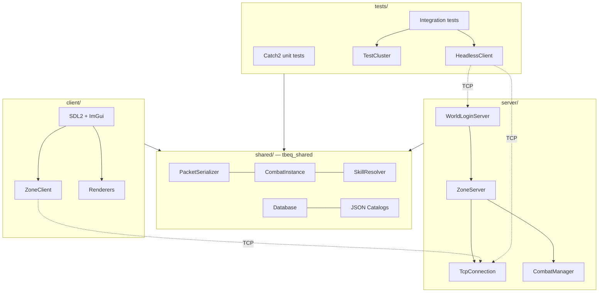
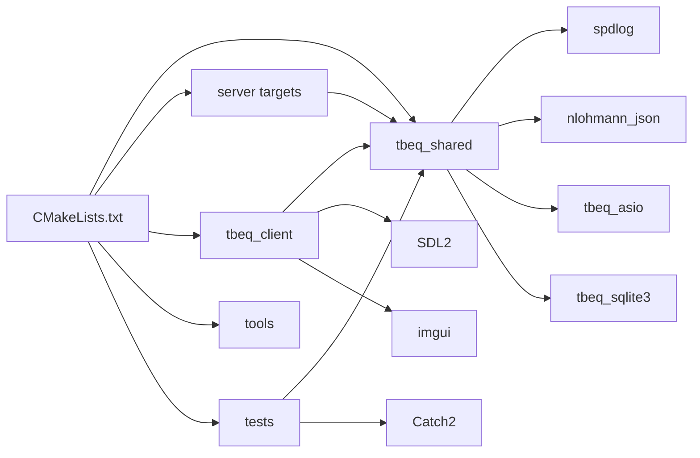
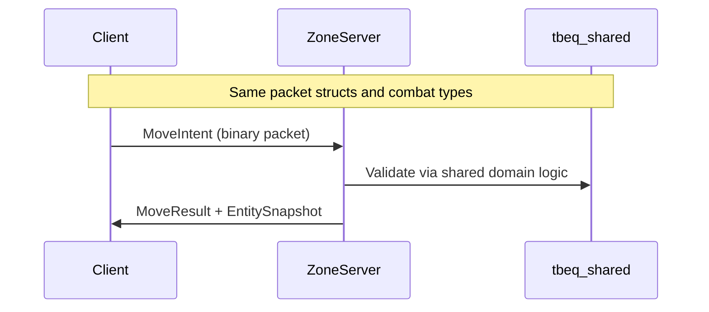
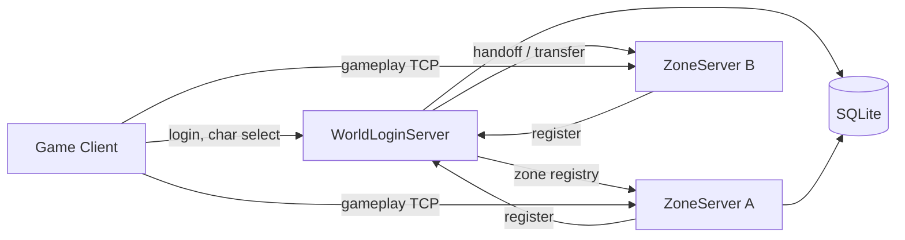
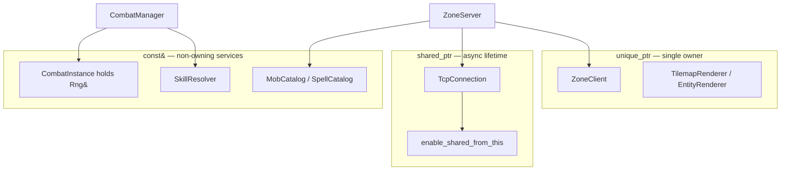
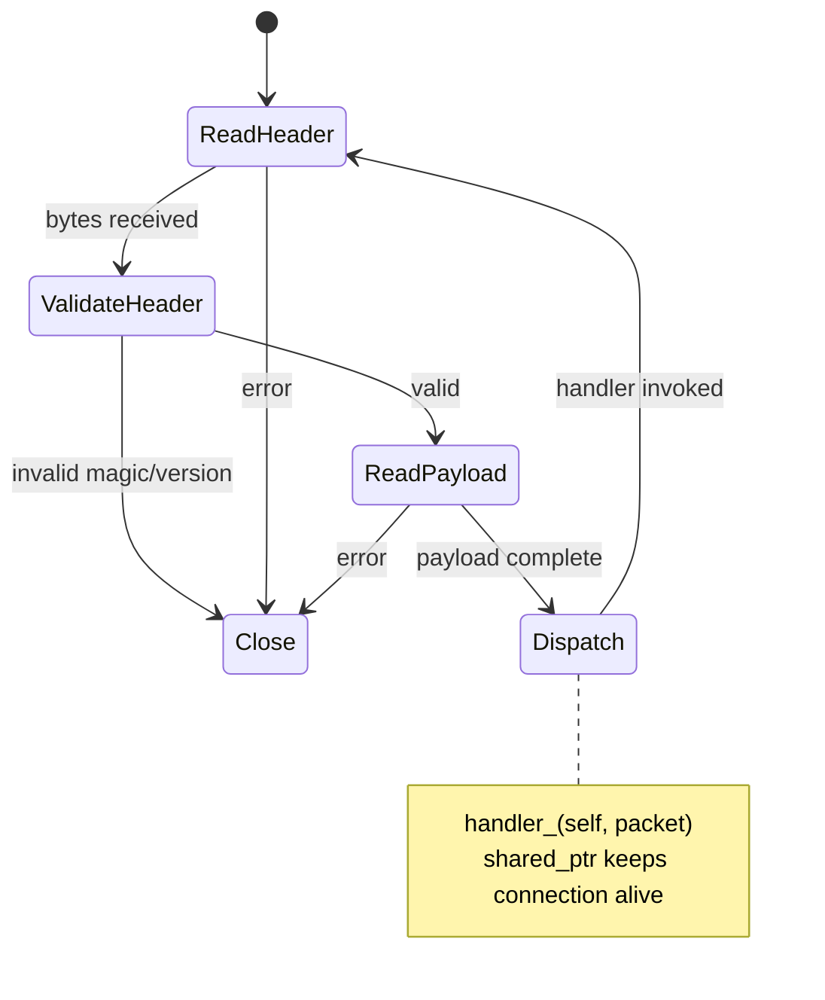
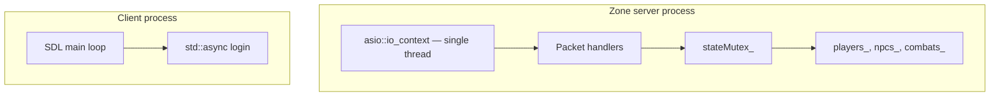
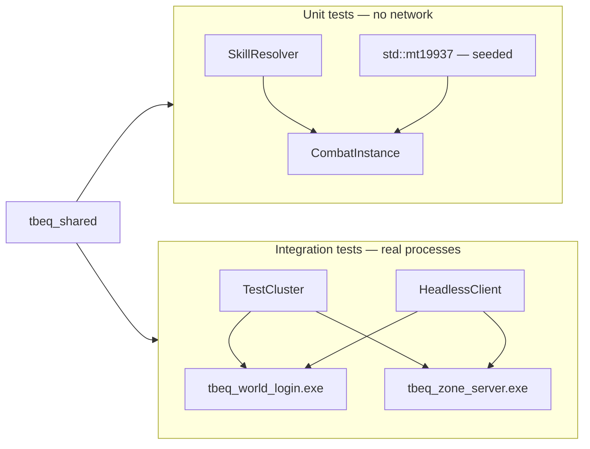
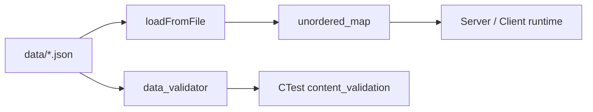

# TurnBasedEQ — C++ Architecture & Feature Guide

This document summarizes the C++ language features, architectural patterns, and engineering tradeoffs used throughout TurnBasedEQ. It is an onboarding reference for contributors who want to understand *why* the codebase is structured the way it is—not just *what* it contains.

---

## Project summary

TurnBasedEQ is a greenfield C++20 MMO foundation: a distributed server cluster (WorldLogin + Zone servers), a shared domain library used by client and server, binary protocol serialization, SQLite persistence, an SDL2 + ImGui client, and Catch2 unit + integration tests with real process spawning. The design prioritizes explicit ownership, type-safe domain modeling, and testable boundaries over template metaprogramming.

In practice, that means **practical modern C++**—readable domain code and clear boundaries rather than heavy metaprogramming.

---

## Table of contents

1. [Project topology](#project-topology)
2. [C++20 baseline and toolchain](#c20-baseline-and-toolchain)
3. [Architecture overview](#architecture-overview)
4. [Modern C++ features in use](#modern-c-features-in-use)
5. [Memory and ownership](#memory-and-ownership)
6. [Networking and binary protocol](#networking-and-binary-protocol)
7. [Concurrency model](#concurrency-model)
8. [Persistence and external C APIs](#persistence-and-external-c-apis)
9. [Deterministic game logic and testing](#deterministic-game-logic-and-testing)
10. [Content-driven design](#content-driven-design)
11. [Build and quality engineering](#build-and-quality-engineering)
12. [Deliberate omissions](#deliberate-omissions)
13. [Design highlights](#design-highlights)
14. [Feature checklist](#feature-checklist)

---

## Project topology



| Path | Purpose |
|------|---------|
| `shared/` | Logging, config, binary packet serializers, combat, skills, persistence, content catalogs |
| `server/world_login/` | World/Login server — zone registry, auth handoff |
| `server/zone/` | Zone server — gameplay simulation, combat, inventory |
| `server/common/` | Shared server utilities (TCP, debug commands) |
| `client/` | SDL2 + ImGui game client |
| `tools/` | Data validator, worldgen CLI |
| `tests/` | Catch2 unit + integration tests |
| `data/` | JSON seed content |

Namespaces follow the same boundaries: `tbeq::net`, `tbeq::combat`, `tbeq::content`, `tbeq::server`, etc.

---

## C++20 baseline and toolchain

From the root `CMakeLists.txt`:

| Setting | Value | Rationale |
|---------|-------|-----------|
| `CMAKE_CXX_STANDARD` | 20 | `std::span`, chrono, filesystem, optional |
| `CMAKE_CXX_STANDARD_REQUIRED` | ON | No accidental downgrade |
| `CMAKE_CXX_EXTENSIONS` | OFF | Portable, standards-conformant code |
| `CMAKE_EXPORT_COMPILE_COMMANDS` | ON | IDE/clangd support |

Windows-specific compile definitions: `NOMINMAX`, `WIN32_LEAN_AND_MEAN`, `_WIN32_WINNT=0x0A00`.

Dependencies are vendored via CMake `FetchContent` (ASIO, Catch2, nlohmann-json, SDL2, spdlog, sqlite) with ImGui from vcpkg.



**Rationale:** The standard was locked early so the project could use `span`, chrono, and filesystem cleanly without relying on compiler extensions.

---

## Architecture overview

### Shared library as the contract

Combat, skills, items, and packet types live in `tbeq_shared` and are linked by the client, both server processes, and all tests. The server is authoritative; the client renders state and sends intents. Sharing types prevents client/server drift.



### Composition over god objects

`CombatManager` receives injected callbacks instead of inheriting from `ZoneServer`:

```cpp
// server/zone/combat/CombatManager.hpp (abbreviated)
using FindPlayerFn = std::function<PlayerView*(const std::string& characterId)>;
using BroadcastFn = std::function<void(
    const std::vector<std::string>& characterIds,
    net::ClientPacketType type,
    const net::ByteWriter& writer)>;
```

This keeps combat logic testable and avoids circular dependencies between subsystems.

### Server cluster



---

## Modern C++ features in use

### Type-safe enums (`enum class`)

Domain and wire enums use scoped enums with fixed underlying types:

```cpp
// shared/include/tbeq/combat/CombatTypes.hpp
enum class CombatSide : uint8_t { Player = 0, Enemy = 1 };
enum class CombatPhase : uint8_t { SelectAction = 0, Resolving = 1, Ended = 2 };
enum class CombatOutcome : uint8_t { InProgress = 0, Victory = 1, Defeat = 2, Fled = 3 };
```

Packet types follow the same pattern in `shared/include/tbeq/net/PacketTypes.hpp`.

**Benefits:** no implicit int conversions, exhaustive switches, stable wire sizes.

### Plain structs + behavior (not deep inheritance)

Domain types are mostly POD-like structs with methods where needed (`CombatParticipant`, `CharacterState`, packet payloads). Catalogs return non-owning pointers:

```cpp
// shared/include/tbeq/content/ItemCatalog.hpp
const ItemDef* findItem(const std::string& itemId) const;
```

### `std::optional`

Used for DB lookups, headless test clients, client login flow, and zone grid queries—avoids sentinel values without exceptions everywhere.

### `std::span` (C++20)

Zero-copy views over packet payload bytes:

```cpp
// shared/include/tbeq/net/PacketSerializer.hpp
class ByteReader
{
public:
    explicit ByteReader(std::span<const uint8_t> data);
private:
    std::span<const uint8_t> data_;
    std::size_t offset_ = 0;
};
```

`ByteWriter::take()` returns the buffer via move: `return std::move(buffer_);`

### `std::filesystem`

Paths for JSON content, DB files, test repo root, and executable discovery—used in catalogs, worldgen, and integration tests.

### `std::chrono`

Typed durations for integration test timeouts, session expiry, combat timers, and async login polling.

### `constexpr` and compile-time checks

```cpp
// shared/include/tbeq/net/PacketHeader.hpp
constexpr uint32_t kPacketMagic = 0x54424551; // 'TBEQ'
constexpr std::size_t kMaxPayloadSize = 1024 * 1024;

#pragma pack(push, 1)
struct PacketHeader { /* ... */ };
#pragma pack(pop)

static_assert(sizeof(PacketHeader) == 24, "PacketHeader must be 24 bytes");
```

### Raw string literals

SQL schema embedded with `R"SQL(...)SQL"` in `shared/src/persistence/Database.cpp`.

### Move semantics and deleted copies

| Type | Pattern |
|------|---------|
| `Database` | Copy deleted; RAII wrapper around `sqlite3*` |
| `ProcessHandle` | Move-only RAII for spawned test processes |
| `TcpConnection` | Moves socket and handler in constructor |
| `ByteWriter` | Move-out via `take()` |

```cpp
// tests/helpers/TestCluster.hpp
ProcessHandle(const ProcessHandle&) = delete;
ProcessHandle(ProcessHandle&& other) noexcept;
```

### Lambdas and `std::function`

- `CombatManager` — injected callbacks for player lookup, broadcast, persistence
- `ZoneClient` — typed callbacks per packet category (`ChatCallback`, `CombatStartCallback`, …)
- Client `main.cpp` — lambdas for packet dispatch; `std::async` for non-blocking login

### Standard algorithms

`std::any_of`, range-for over containers—idiomatic STL rather than hand-rolled loops.

---

## Memory and ownership



| Pattern | Where | Rationale |
|---------|-------|-----------|
| `std::unique_ptr` | Client subsystems | Clear single owner |
| `std::shared_ptr` + `enable_shared_from_this` | `TcpConnection` | Safe lifetime in ASIO completion handlers |
| References to catalogs/services | `CombatInstance`, `ClassCombatBrain` | Non-owning; lifetime at composition root |
| Raw `sqlite3*` in `Database` | Wrapped in ctor/dtor | Classic C API RAII |
| `std::deque` write queue | TCP outbound | Efficient front pop for chained async writes |

**Key principle:** Shared ownership is limited to objects whose lifetime must survive async callbacks—connections. Everything else uses unique ownership or non-owning references with explicit lifetime rules set at startup.

---

## Networking and binary protocol

### ASIO async I/O

Standalone ASIO (`ASIO_STANDALONE`) drives all TCP. No Boost dependency.



Key implementation (`server/common/net/TcpConnection.cpp`):

1. `async_read` fixed-size `PacketHeader`
2. Validate with `header.isValid()`
3. `async_read` payload into `readBuffer_`
4. Invoke `PacketHandler` callback
5. Re-arm read loop

Writes queue into `std::deque<std::vector<uint8_t>>`; `doWrite()` chains `async_write` until the queue is empty.

### Manual serialization

No protobuf or codegen—explicit `ByteWriter` / `ByteReader` plus overloads:

- `serialize(payload)` → `ByteWriter`
- `deserializeClientPacket(packet, payload&)` → `bool`
- `encodePacket` / `decodePacket` for framing

Every major packet type has a **round-trip test** in `tests/unit/net/packet_roundtrip_test.cpp`.

**Rationale:** A hand-rolled binary protocol provides predictable layout, straightforward versioning, and no codegen dependency. Round-trip tests lock in wire compatibility.

---

## Concurrency model

This is **not** a heavily threaded simulation architecture:



| Mechanism | Usage |
|-----------|-------|
| `asio::io_context` | Event-driven server I/O (one thread per process) |
| `std::mutex` + `std::lock_guard` | Protects shared zone/world state maps |
| `std::async` + `std::future` | Offloads login from SDL UI thread |
| `std::thread` + `std::atomic` | Debug unit-test runner background worker |

**Rationale:** Concurrency is minimal and localized. The authoritative simulation runs on the io thread; mutexes guard shared maps rather than spreading atomics through domain logic.

---

## Persistence and external C APIs

`Database` wraps SQLite with:

- RAII `open()` / `close()` in ctor/dtor
- Copy deleted
- Prepared statements with `bindText()` helpers
- `std::optional<AccountRecord>` (and similar) for queries
- Pragmas: `foreign_keys`, `journal_mode=WAL`, `busy_timeout`

Character state uses a hybrid pattern: relational tables for accounts/characters, JSON blob for runtime state via `CharacterState::toJson()` / `fromJson()` (nlohmann-json).

---

## Deterministic game logic and testing



| Technique | Purpose |
|-----------|---------|
| Injected `std::mt19937&` in `CombatInstance` | Reproducible combat rolls in tests |
| `SkillResolver` | Encapsulates hit/damage/flee formulas |
| Shared combat library | Test resolution without spinning servers |
| `TestCluster` | Spawns real server exes on ephemeral ports |
| `ProcessHandle` | Move-only RAII; terminates processes on scope exit |
| `HeadlessClient` | ASIO TCP driver; no SDL required |

Example integration flow (`tests/integration/combat_encounter_test.cpp`): create account → login → select character → connect to zone → trigger combat via debug command → assert packets.

---

## Content-driven design

JSON catalogs load at startup into `std::unordered_map<std::string, T>`:

| Catalog | Data file | Lookup API |
|---------|-----------|--------------|
| `ItemCatalog` | `data/items.json` | `findItem(id)` |
| `MobCatalog` | `data/mobs.json` | `findMob(id)` |
| `SpellCatalog` | `data/spells.json` | `findSpell(id)` |
| `NpcCatalog` | `data/npcs.json` | `findNpc(id)` |

`tools/data_validator` runs as a CTest target to validate JSON shape before runtime.



---

## Build and quality engineering

- **Catch2 v3** — `TEST_CASE("...", "[tag]")` with tags like `[net]`, `[combat]`, `[render]`
- **CI** — GitHub Actions: Release build + `ctest --output-on-failure`
- **Split compilation** — e.g. `ZoneServerInventory.cpp` to keep translation units manageable
- **Conditional features** — `TBEQ_ENABLE_DEBUG_MENU`, `TBEQ_REPO_ROOT` compile definition for tests
- **Dev cluster script** — `scripts/run_cluster.ps1` launches WorldLogin + ZoneServer locally

---

## Deliberate omissions

The following techniques were intentionally avoided or kept minimal in favor of simpler alternatives:

| Not used (or minimal) | Alternative chosen |
|----------------------|-------------------|
| Heavy templates / CRTP / concepts | Overloaded serialize functions, plain structs |
| `std::variant` for packets | Typed payloads + enum dispatch |
| Coroutines (`co_await`) | Classic ASIO callbacks + `shared_from_this` |
| Wide inheritance hierarchies | Structs + catalogs + free functions |
| Global singletons | Injected refs/callbacks at server startup |
| `shared_ptr` everywhere | Scoped to connection lifetime only |
| `std::format` / ranges | fmt via spdlog; conventional loops |

**Rationale:** Templates are reserved for cases where they pay off long-term. Early on, explicit packet structs and overloads are easier to debug, grep, and test. The architecture leaves room for codegen or stronger compile-time schemas once the protocol stabilizes.

---

## Design highlights

Notable architectural decisions worth understanding when navigating the codebase:

### Shared library as client/server contract

Combat, items, skills, and packet types live in `tbeq_shared`. Server is authoritative; client renders and sends intents. Same types → no drift.

### Async TCP with explicit lifetime

`TcpConnection` flow: accept → `make_shared` → async read chain → write queue → `enable_shared_from_this` in handlers. Capturing raw `this` in ASIO callbacks would be undefined behavior; the shared-pointer pattern extends connection lifetime safely.

### RAII test infrastructure

`TestCluster` picks ephemeral ports, spawns processes, and `ProcessHandle` terminates on scope exit. `HeadlessClient` drives the real protocol. Integration tests exercise production code paths, not mock-only substitutes.

### Type-safe domain + wire format

`enum class` for combat actions and packet types; `static_assert` on header size; round-trip tests. Compatibility and versioning were considered from the start.

### Composition over god objects

`CombatManager` receives callbacks instead of inheriting from `ZoneServer`. Combat stays testable and dependency direction remains clean.

---

## Feature checklist

Quick reference of C++ capabilities used in the project:

| Category | Features |
|----------|----------|
| **Standard** | C++20 (span, chrono, filesystem, optional, constexpr) |
| **RAII** | Database, ProcessHandle, TCP socket, SDL resources |
| **Ownership** | unique_ptr, shared_ptr, enable_shared_from_this, move-only types |
| **Types** | enum class, fixed-width integers, plain structs |
| **API design** | Non-owning refs, const-correct catalogs, callback injection |
| **I/O** | Standalone ASIO, async read/write chains, binary protocol |
| **Containers** | unordered_map, vector, deque |
| **Algorithms / RNG** | mt19937, standard algorithms |
| **Concurrency** | mutex, lock_guard, async, atomic (targeted) |
| **Interop** | SQLite C API wrapper, nlohmann-json |
| **Testing** | Catch2 unit + integration, process spawning |
| **Build** | CMake modular targets, FetchContent, compile definitions |

---

## Key source files

| Topic | Primary files |
|-------|---------------|
| Packet framing | `shared/include/tbeq/net/PacketHeader.hpp` |
| Serialization | `shared/include/tbeq/net/PacketSerializer.hpp`, `shared/src/net/PacketSerializer.cpp` |
| TCP | `server/common/net/TcpConnection.hpp`, `TcpConnection.cpp` |
| Zone simulation | `server/zone/ZoneServer.hpp`, `ZoneServer.cpp` |
| Combat | `shared/include/tbeq/combat/CombatInstance.hpp`, `server/zone/combat/CombatManager.hpp` |
| Persistence | `shared/include/tbeq/persistence/Database.hpp` |
| Integration tests | `tests/helpers/TestCluster.hpp`, `tests/helpers/HeadlessClient.hpp` |
| Build | `CMakeLists.txt`, `shared/CMakeLists.txt` |

---

## Related documentation

- [README.md](../README.md) — build, run, and project layout
- `.github/workflows/ci.yml` — continuous integration pipeline
