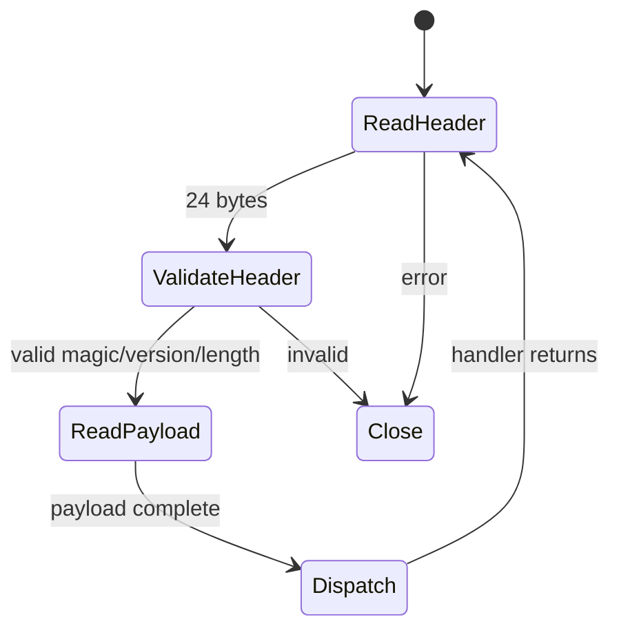
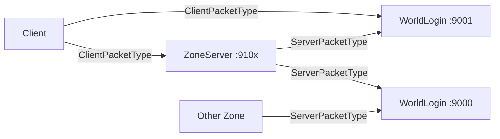

# Networking and Protocol

TurnBasedEQ uses a **custom binary TCP protocol** with standalone ASIO. All packet structs and serializers live in `tbeq_shared` so client and servers stay in sync.

See also: [auth.md](auth.md), [server.md](server.md), [client.md](client.md).

---

## Transport

| Property | Value |
|----------|-------|
| Protocol | TCP |
| Library | Standalone ASIO (`ASIO_STANDALONE`) |
| Server I/O model | Async (`async_read` / `async_write` chains) |
| Client I/O model | Blocking read/write with timeouts on gameplay socket |
| Encryption | None (local dev) |

---

## Packet framing

Every message is a fixed **24-byte header** followed by a variable payload.

```cpp
// shared/include/tbeq/net/PacketHeader.hpp
constexpr uint32_t kPacketMagic = 0x54424551; // 'TBEQ'
constexpr uint16_t kProtocolVersion = 1;
constexpr std::size_t kMaxPayloadSize = 1024 * 1024;

struct PacketHeader
{
    uint32_t magic;
    uint16_t protocolVersion;
    uint16_t packetType;
    uint32_t sequenceId;
    uint32_t payloadLength;
    uint64_t sessionTokenHash;
};
```

`static_assert(sizeof(PacketHeader) == 24)`.

### Read pipeline (server)



Implementation: `server/common/net/TcpConnection.cpp`.

---

## Packet type namespaces

Two enum classes in `shared/include/tbeq/net/PacketTypes.hpp`:

### ClientPacketType (client ↔ server gameplay + login)

Used on WorldLogin client port (9001) and zone client ports (9100+).

| Range | Category | Examples |
|-------|----------|----------|
| 1–2 | Keepalive | `Ping`, `Pong` |
| 10–13 | Auth | `LoginRequest`, `CreateAccountRequest` |
| 20–25 | Characters | `CharacterListRequest`, `SelectCharacterRequest`, `ZoneConnectInfo` |
| 30–41 | Zone state | `SessionResume`, `ZoneSnapshot`, `MoveIntent`, `UsePortal` |
| 50–59 | Combat | `CombatStart`, `SubmitAction`, `MeditateRequest` |
| 60–71 | Items/NPCs | `InventorySnapshot`, `MerchantBuyRequest`, `NpcDialogOpen` |
| 72 | Session | `SessionEnd` |
| 100–101 | Debug | `DebugCommandRequest`, `DebugCommandResponse` |

### ServerPacketType (zone ↔ WorldLogin)

| Range | Category | Examples |
|-------|----------|----------|
| 10–11 | Registration | `ZoneRegister`, `ZoneRegisterAck` |
| 20–21 | Player enter | `PlayerEnterPrepare`, `PlayerEnterReady` |
| 30–31 | Character load | `LoadCharacterRequest`, `LoadCharacterResponse` |
| 40–44 | Transfer | `ZoneTransferRequest`, `ZoneTransferAuthorize`, `PlayerDisconnect` |
| 100–101 | Debug | Server-side debug relay |

---

## Serialization

**Files:** `shared/include/tbeq/net/PacketSerializer.hpp`, `shared/src/net/PacketSerializer.cpp`

| Type | Role |
|------|------|
| `ByteWriter` | Append typed fields; `take()` returns buffer |
| `ByteReader` | Read from `std::span<const uint8_t>` with bounds checks |
| `SerializedPacket` | Header + payload vector |

API pattern:

```cpp
net::ByteWriter writer;
net::serialize(payload, writer);
auto packet = net::encodePacket(type, sequenceId, writer.take(), sessionTokenHash);

// Reverse:
net::SomePayload payload;
if (!net::deserializeClientPacket(packet, payload)) { /* invalid */ }
```

Primitive overloads for strings, vectors, enums, and nested structs. Every major payload has round-trip unit tests.

---

## Connection topology



- **Login traffic** uses WorldLogin client port until `ZoneConnectInfo` is received.
- **Gameplay traffic** uses the zone server's client port exclusively after handoff.
- Zone servers maintain a persistent **world link** TCP connection to WorldLogin for registration and transfers.

---

## Login and handoff sequence

See [architecture-overview.md](architecture-overview.md) for the full diagram. Key payloads:

| Payload | Direction | Fields (summary) |
|---------|-----------|------------------|
| `LoginRequestPayload` | C → WL | username, password |
| `LoginResponsePayload` | WL → C | success, message, sessionToken |
| `SelectCharacterRequestPayload` | C → WL | characterId |
| `ZoneConnectInfoPayload` | WL → C | host, port, characterId, sessionTokenHash, zoneId |
| `SessionResumePayload` | C → Z | characterId, sessionTokenHash |
| `ZoneSnapshotPayload` | Z → C | zone metadata, player position, entity list |

---

## Gameplay packets (selected)

### Movement

| Packet | Purpose |
|--------|---------|
| `MoveIntent` | Client requests tile (x, y) |
| `MoveResult` | Success/failure, updated position |
| `EntitySnapshot` | All visible entities (broadcast) |

### Combat

| Packet | Purpose |
|--------|---------|
| `CombatStart` | Participants, turn order, initial state |
| `CombatUpdate` | Phase, current actor, timers |
| `CombatEvent` | Damage, miss, spell, status, etc. |
| `SubmitAction` | Player chosen action |
| `SubmitActionResult` | Accept/reject with message |
| `CombatEnd` | Outcome, rewards summary |

### Economy

| Packet | Purpose |
|--------|---------|
| `InventorySnapshot` | Full inventory + equipment |
| `MerchantOpen` | NPC stock and prices |
| `MerchantBuyRequest/Result` | Purchase transaction |
| `MerchantSellRequest/Result` | Sell transaction |

### Zone travel

| Packet | Purpose |
|--------|---------|
| `UsePortal` | Request portal use at current tile |
| `UsePortalResult` | New `ZoneConnectInfo` or error |

---

## Sequence IDs

Each connection maintains a monotonically increasing `sequenceId` per outbound packet. Used for request/response correlation on synchronous client calls.

---

## Session token in header

`PacketHeader.sessionTokenHash` carries the FNV-1a hash of the session token on authenticated gameplay packets. Issued at login; validated by zone servers against WorldLogin handoff data.

---

## Debug protocol

When `--dev-mode` is active on servers:

```cpp
enum class DebugCommand : uint16_t
{
    SpawnMob = 10,
    KillTarget = 11,
    GodMode = 12,
    // ...
};
```

Payload: `DebugCommandRequestPayload` with command + string args vector.

---

## Testing

| Test | Location |
|------|----------|
| Round-trip serialization | `tests/unit/net/packet_roundtrip_test.cpp` |
| Debug commands | `tests/unit/server/debug_command_test.cpp` |
| Login handoff (integration) | `tests/integration/login_and_handoff_test.cpp` |
| Headless protocol driver | `tests/helpers/HeadlessClient.cpp` |

---

## Versioning strategy

- `kProtocolVersion` in header; invalid version closes connection
- New packet types append to enum without renumbering existing values
- `static_assert` on header size prevents struct layout drift

---

## Related documentation

- [auth.md](auth.md) — session tokens
- [server.md](server.md) — TcpConnection implementation
- [data-models.md](data-models.md) — payload-related domain structs
- [cpp-architecture.md](cpp-architecture.md) — ASIO lifetime patterns
