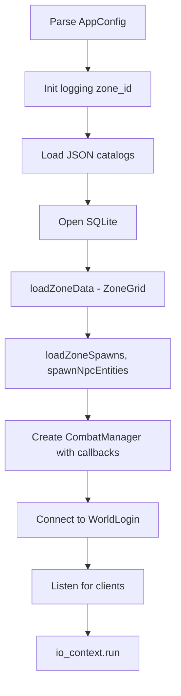

# Server Components

TurnBasedEQ servers consist of **WorldLogin** (auth and broker) and **ZoneServer** (per-zone gameplay), plus shared TCP infrastructure in `server/common/`.

See also: [architecture-overview.md](architecture-overview.md), [networking.md](networking.md), [combat-system.md](combat-system.md).

---

## Build targets

Defined in `server/CMakeLists.txt`:

| Target | Sources | Links |
|--------|---------|-------|
| `tbeq_server_common` | `TcpConnection`, `DebugCommandHandler` | `tbeq_shared` |
| `tbeq_world_login` | `WorldLoginServer`, `main.cpp` | `tbeq_server_common` |
| `tbeq_zone_server` | `ZoneServer`, `ZoneServerInventory`, `CombatManager`, `main.cpp` | `tbeq_server_common` |

---

## WorldLoginServer

**Files:** `server/world_login/WorldLoginServer.hpp`, `WorldLoginServer.cpp`, `main.cpp`

### Responsibilities

- Bootstrap SQLite schema and ensure world is generated
- Accept **client connections** on `worldLoginClientPort` (default 9001)
- Accept **zone server connections** on `worldLoginPort` (default 9000)
- Account login, registration, session issuance
- Character list, create, select
- Zone registry (`ZoneRegister` / `ZoneRegisterAck`)
- Player handoff and zone transfer orchestration

### Internal state

| Structure | Purpose |
|-----------|---------|
| `ZoneEntry` | Registered zone id, payload, TCP connection |
| `PendingHandoff` | Character entering a zone from login or transfer |
| `PendingZoneTransfer` | Cross-zone travel in progress |

Mutexes: `zonesMutex_`, `handoffMutex_`, `transferMutex_`.

### Key handlers

| Packet (direction) | Handler behavior |
|--------------------|------------------|
| `ZoneRegister` (zone → WL) | Register zone id, client port, store connection |
| `LoginRequest` (client → WL) | Validate credentials, issue session |
| `SelectCharacterRequest` | Load character, send `PlayerEnterPrepare` to zone |
| `PlayerEnterReady` (zone → WL) | Complete handoff; send `ZoneConnectInfo` to client |
| `ZoneTransferRequest` (zone → WL) | Begin cross-zone transfer |
| `ZoneTransferComplete` (zone → WL) | Update character location in DB |

Auth details: [auth.md](auth.md).

---

## ZoneServer

**Files:** `server/zone/ZoneServer.hpp`, `ZoneServer.cpp`, `ZoneServerInventory.cpp`, `main.cpp`

### Responsibilities

- Register with WorldLogin on startup (`connectAndRegister()`)
- Accept client gameplay connections on `clientPort`
- Load zone grid, spawns, NPC slots from SQLite
- Simulate players, AI companions, NPCs, mob spawns
- Handle movement, combat, chat, portals, inventory, merchants
- Persist character state and location on disconnect/transfer

### Startup sequence



### Entity types

| Struct | Description |
|--------|-------------|
| `PlayerEntity` | Connected human player with TCP connection, combat state, tile position |
| `AiPartyMember` | Server-spawned AI companion following a leader |
| `NpcEntity` | Static NPC (merchant, lorekeeper) with optional stock tracking |
| `ZoneSpawnState` | Mob spawn point with respawn timer |

### Concurrency

`stateMutex_` guards `players_`, `aiCompanions_`, `npcs_`, `spawns_`, and pending transfers. Packet handlers acquire the lock before mutating state.

### Client packet handlers

| Packet | Handler |
|--------|---------|
| `SessionResume` | Restore player in zone, send snapshots |
| `MoveIntent` | Validate walkability, update position, broadcast snapshot |
| `SubmitAction` | Forward to `CombatManager` |
| `MeditateRequest` | Out-of-combat mana regen |
| `EquipItemRequest` / `UnequipItemRequest` | Inventory rules via `ItemRules` |
| `NpcInteractRequest` | Open merchant or lore dialog |
| `MerchantBuyRequest` / `MerchantSellRequest` | Transaction with stock depletion |
| `UsePortal` | Initiate zone transfer via WorldLogin |
| `ChatMessage` | Say channel delivery |
| `SessionEnd` | Graceful save and disconnect |
| `DebugCommandRequest` | Dev-mode cheats (when enabled) |

### World-server packets

| Packet | Direction | Purpose |
|--------|-----------|---------|
| `PlayerEnterPrepare` | WL → zone | Load character into zone |
| `ZoneTransferAuthorize` | WL → zone | Authorize incoming transfer |
| `LoadCharacterRequest/Response` | zone ↔ WL | Fetch character from DB |
| `PlayerDisconnect` | zone → WL | Notify disconnect |
| `ZoneTransferRequest/Complete` | zone ↔ WL | Portal travel |

### Persistence hooks

- `persistPlayerToDatabase()` — saves location and `state_json`
- Called on disconnect, portal transfer, and after combat loot/state changes
- `CombatManager` receives `PersistStateFn` and `SyncInventoryFn` callbacks

---

## CombatManager (server)

**Files:** `server/zone/combat/CombatManager.hpp`, `CombatManager.cpp`

Server-side orchestration layer over shared `CombatInstance`:

- Spawn combat from mob aggro or debug commands
- Turn timers via `asio::steady_timer` (default 30s per turn)
- AI enemy turns and AI companion turns
- Broadcast `CombatStart`, `CombatUpdate`, `CombatEvent`, `CombatEnd`
- Apply skill XP, loot, and persist state

Uses **callback injection** instead of inheriting from `ZoneServer`:

```cpp
using FindPlayerFn = std::function<PlayerView*(const std::string& characterId)>;
using BroadcastFn = std::function<void(
    const std::vector<std::string>& characterIds,
    net::ClientPacketType type,
    const net::ByteWriter& writer)>;
```

See [combat-system.md](combat-system.md).

---

## TCP layer

**Files:** `server/common/net/TcpConnection.hpp`, `TcpConnection.cpp`

### TcpConnection

- `enable_shared_from_this` for safe ASIO callback lifetime
- Read loop: header (24 bytes) → validate → payload → dispatch handler
- Write queue: `std::deque<std::vector<uint8_t>>` with chained `async_write`

### TcpAcceptor

Binds ephemeral or configured port, accepts connections, wraps sockets in `TcpConnection`.

Used by both WorldLogin (two acceptors) and ZoneServer (client acceptor + outbound world link).

Details: [networking.md](networking.md).

---

## Debug commands

**Files:** `server/common/debug/DebugCommandHandler.hpp`, `DebugCommandHandler.cpp`

Enabled when `--dev-mode` is passed. Commands defined in `shared/include/tbeq/net/DebugCommands.hpp`:

| Command | Effect |
|---------|--------|
| `SpawnMob` | Start debug combat with specified mobs |
| `KillTarget` | Kill combat target slot |
| `GodMode` | Toggle participant god mode |
| `ForceCombatEnd` | End combat with given outcome |
| `UnlockAllSpells` | Unlock class spells/abilities |
| `FillMana` | Restore mana |
| `SpawnAi` | Spawn AI party companion |
| `GrantItem` | Add item to inventory |
| `EquipItem` | Force equip |

Client sends `DebugCommandRequest`; zone server validates dev mode and returns `DebugCommandResponse`.

---

## Zone-specific inventory module

`ZoneServerInventory.cpp` holds equip/unequip, merchant buy/sell, and inventory snapshot builders to keep `ZoneServer.cpp` translation unit size manageable.

---

## Configuration

Servers use `tbeq::AppConfig` from `shared/include/tbeq/core/Config.hpp`:

```cpp
struct AppConfig
{
    bool devMode = false;
    std::string zoneId = "starter";
    uint16_t worldLoginPort = 9000;
    uint16_t worldLoginClientPort = 9001;
    uint16_t zoneClientPort = 9100;
    std::string dbPath = "config/tbeq.db";
    int64_t worldSeed = 42;
    // ...
};
```

---

## Related documentation

- [networking.md](networking.md) — protocol details
- [data-models.md](data-models.md) — DB and entity models
- [shared.md](shared.md) — domain libraries used by servers
- [build-and-run.md](build-and-run.md) — starting servers
